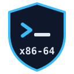
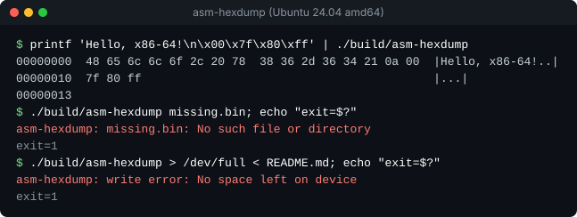
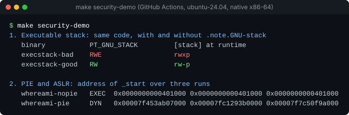

<p align="center">
  
</p>

<h1 align="center">x86-64 Assembly and Binary Hardening Lab</h1>

<p align="center">
  <a href="https://github.com/VijaysinghPuwar/x86-64-assembly-intro-lab/actions/workflows/ci.yml"></a>
  
  <a href="LICENSE"></a>
</p>

Hand-written x86-64 NASM programs for Linux, built as hardened ELF binaries
and checked by CI security gates. The project finds real correctness and
security bugs in a beginner assembly lab, explains them, fixes them, and
verifies automatically that they stay fixed. It also includes `asm-hexdump`,
a syscall-only hex dump utility whose output is tested byte for byte against
reference implementations.

## Why this exists

It started as a coursework lab: three small programs, shown only as
screenshots in a PDF. Rebuilding them exactly as written turned up an
executable stack, a SysV ABI violation, an oversized memory load and silent
write failures, all in code that printed the right answer. This repository is
that lab rebuilt as a reproducible systems and binary-hardening project. It is
a learning project, not production software.

## What it demonstrates

- **x86-64 assembly (NASM):** syscall-only programs with no libc, plus libc interop
- **Linux syscall ABI and SysV AMD64 calling convention:** register use, preserved registers, 16-byte stack alignment, variadic calls
- **ELF internals:** program headers, PIE vs `ET_EXEC`, static PIE, relocations, RELRO, `PT_GNU_STACK`
- **Exploit mitigations:** NX (non-executable stack), ASLR via PIE, full RELRO, and when each one actually applies
- **Secure build pipeline:** linker flags that make insecure code a build error, plus a readelf-based gate in CI
- **Testing:** golden output, error paths, buffer boundaries, deterministic stress tests against independent references
- **Debugging and reverse engineering:** gdb, strace, objdump, readelf and nm used to answer concrete questions

## Highlights

| | |
|---|---|
| **Bugs found and fixed** | Executable stack, misaligned `printf` call, 8-byte load of a 4-byte value, `-no-pie` workaround, exit status 0 on failed writes ([errata](report/README.md)) |
| **asm-hexdump** | `hexdump -C -v` compatible, about 300 lines of assembly, 4 KiB buffered I/O, correct across short reads, `strerror`-style error messages |
| **Hardening gate** | [`scripts/check-elf.sh`](scripts/check-elf.sh) checks PIE, NX, RWX segments, text relocations and RELRO per binary type, and is itself tested against known-bad binaries |
| **ABI probe** | [`tests/abi_probe.asm`](tests/abi_probe.asm) intercepts libc calls with `ld --wrap` and asserts stack alignment, instead of hoping a misaligned call crashes |
| **Runtime proof** | Tests read the kernel's actual `[stack]` permissions, confirm ASLR across runs, and assert each program's exact syscall set with strace |
| **CI** | Native x86-64, warnings are errors, tests that need a real kernel fail rather than skip, byte-identical rebuilds |

## Quick start

On Ubuntu 24.04 or Debian (including WSL 2 on Windows):

```sh
sudo apt install nasm build-essential python3 bsdextrautils
git clone https://github.com/VijaysinghPuwar/x86-64-assembly-intro-lab.git
cd x86-64-assembly-intro-lab
make test              # build everything and run the test suite
./build/asm-hexdump README.md | head -3
```

On macOS, including Apple Silicon, the binaries are Linux x86-64 and cannot
run natively. Use the included Dockerfile:

```sh
docker build --platform linux/amd64 -t asm-lab .
docker run --rm --platform linux/amd64 -v "$PWD":/src asm-lab make test
```

Under emulation, the tests that depend on a real x86-64 kernel (stack
permissions, ASLR, strace, gdb) are skipped. CI runs all of them natively.

## Examples

`asm-hexdump` reads a file or stdin and reports errors the way standard Unix
tools do:



The security demo builds each insecure variant next to its hardened twin.
This capture is the first two sections of `make security-demo` on a native
CI runner:



Both images are rendered from captured command output, not mockups.

## Binary security

All values below were verified with `readelf` and at run time on the CI
runner. Details: [security/README.md](security/README.md).

| Property | Original lab build | This repo |
|---|---|---|
| `add` stack (`PT_GNU_STACK`) | `RWE` (executable) | `RW` |
| `hello` stack header | missing (kernel default) | `RW` |
| Position independent | no: `ET_EXEC`, linked with `-no-pie` | yes: all four programs are PIEs |
| `add` RELRO | not checked | full (`PT_GNU_RELRO` + `BIND_NOW`) |
| Stack alignment at `printf` | `rsp % 16 == 0` at entry (ABI violation) | `rsp % 16 == 8` (correct), enforced by a test |
| Exit status when stdout fails | 0 | 1, with an error message |
| Regression protection | none | linker guards + `make check-hardening` + CI |

## Testing

```sh
make test              # unit and integration tests (Python unittest, no dependencies)
make check-hardening   # ELF security gate on the four programs
make stress            # about 2,900 seeded cases against independent references
make security-demo     # insecure vs hardened builds, side by side
```

`make test` runs 57 tests. They cover exact stdout, stderr and exit status
for every program, error paths (missing file, permission denied, directory,
full disk, closed descriptors, socket errors), `asm-hexdump` at every buffer
and flush boundary, short reads from a pipe, a read error mid-stream, and the
hardening gate against binaries that must fail it. `make stress` checks 2,067
distinct input sizes, six byte patterns, 300 piped inputs, 501 repeated runs,
unusual file names and a 16 MiB file. Every output is compared against a
Python reference implementation and, where installed, the system
`hexdump -C -v`.

## Repository layout

```
src/        the programs: hello, star, add, asm-hexdump (hexdump.asm), shared io.asm
include/    linux.inc: syscall numbers, errno values, stack-note macro
security/   insecure vs hardened demos and the hardening write-up
scripts/    check-elf.sh (hardening gate), security-demo.sh
tests/      test suite, stress test, ABI probe
docs/       calling conventions, binary inspection walkthrough, compiler output comparison
report/     the original 2025 coursework report and its errata
```

Further reading:

- [x86-64 Linux calling conventions](docs/x86-64-linux-abi.md)
- [Inspecting the binaries with file, readelf, nm, objdump, strace and gdb](docs/inspecting-binaries.md)
- [Hand-written vs compiler-generated assembly](docs/compiler-output.md)

## Original coursework

The project began as a July 2025 lab report on installing NASM on Ubuntu
(WSL 2) and building three programs. The report is kept unchanged in
[report/](report/), with [errata](report/README.md) for what re-testing it
found. This repository extends that lab; the first commits transcribe the
original programs verbatim, so `git log -p src/` shows every fix.

## License

[MIT](LICENSE)
